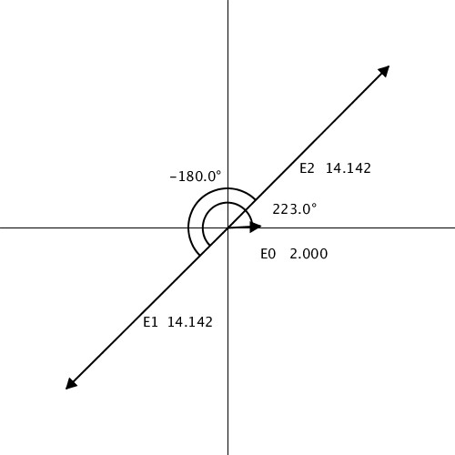

# DrawVector

ベクトル図作成ツール




## 使い方

#### ベクトル追加

drawVector内のvector.csvに以下の書式でベクトルを記述してください。

大きさと角度でベクトルを定義したい場合

```csv
Name,Length,Angle,la

ex.
e0,14,45,la
```

座標でベクトルを定義したい場合

```
Name,x,y,p

ex.
e1,10,10,p
```

#### 位相差を表示させたい場合

vector.csvで定義したベクトルに順番に0から番号が振ってあるので、drawVector内のangle.csvに以下の書式で指定してください。一つ目を基準に計算します。

```
v1.Number,v2.Number

ex.
0,1
```


ラベルはマウスでドラックして位置を変更することができます。

多分ラベルをウィンドウ外まで持って行ってスクショを撮ってあとでパワポ等で書き直した方が良いです。

スペースキーを押すとスクリーンショットを撮影できます。


何かバグ等があったらissueに追加するか直接kawakamiに言ってください。

結構汚いコードで申し訳ないです。


### 実行環境

proessing 3


kawakami.


